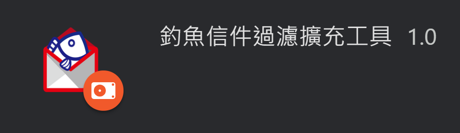
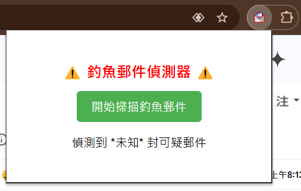
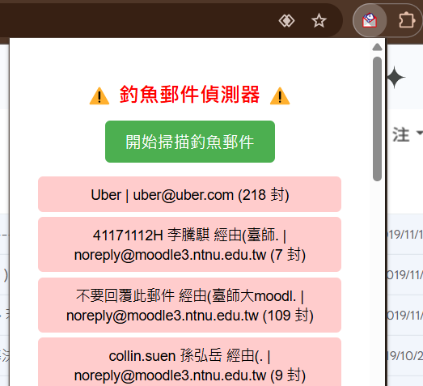
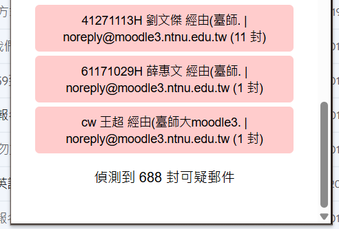
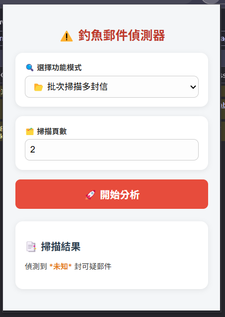
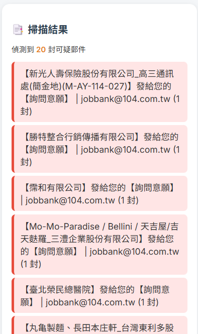
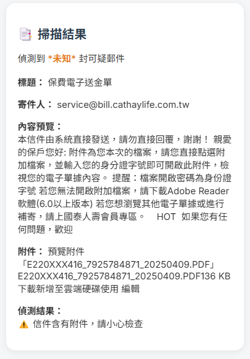

# Chrome 擴充工具測試

這是關於我在嘗試學習如何使用chrome，並構思如何與專題結合的程式碼。

# 【簡介】

## **目前進度**:
### 【3/13回報】
1. 我目前有跟著官方教學完成練習，練習的程式碼分別為c_hello、focus-mode、quick-api-reference、reading-time，並且了解要如何使用這些擴充工作
2. 有開始思考需要用到的images、icons
3. 有嘗試製作一個假設的釣魚信件擴充工具(phishing-detector)，但因為還在學習跟嘗試階段，目前只有基本模樣
4. 可以討論、思考的地方:
- 呈現方式(自動化偵測，部會有額外的UI介面、popup視窗、右鍵選單)
- UI設計(繪製還是找現有圖片、有什麼需要包含的元素)=>目前暫時傾向部分繪製、部分使用現成好理解的icon

### 【3/20回報】
1. 製作了一個擴充工具的LOGO圖片
2. 在目前測試版中的擴充工具，可以成功的偵測關鍵字，並且在Email中做記號，但是在UI介面跑出異常數量的時候，會無法正常偵測，因此還在修改這個部分
3. 會打算採用popup視窗，結合Email中的特殊標記，來作為呈現方法
4. 有延伸思考要製作的功能:
   - 要如何呈現回饋內容的部分，比如滑鼠在該釣魚信件的上方，或是進行點擊，會跳出回饋訊息
   - 想研究是否可以直接在使用擴充工具時，自動過濾掉釣魚信件，讓該信件不會不會被顯示，或是直接變成已讀狀態
   - 想嘗試在UI視窗加一點動畫，或是增加設計

### 【3/27回報】
1. 製作第二版本的釣魚信季偵測器 ([fishmail2.0](https://github.com/MocuAcqu/Chrome_test/tree/main/fishemail2.0))
   - 可以抓取到所有信件，而不會只抓取第一頁信件
   - 可以將所有信件存在關鍵字的標題、寄信人紅標
   - popup可以正確顯示異常信件數量，並會相同標題的異常信件有多少封
   - 啟動偵測的條件改為按下popup視窗的"開始掃描釣魚信件"
   - 小調整popup視窗設計

### 【4/13回報】
1. 當批次偵測完後，會自動回Gmail第一頁
2. 解決信件重複計算的問題
3. 將偵測單位修改為"頁"
4. 使用者可以在popup視窗自訂義偵測的頁數，且會根據使用者總信數來定義能偵測的最大頁數
5. 可以單獨偵測一封信件(標題、寄信人、內容、附件)是否有異常
6. 可以再popup視窗上選擇要"批次偵測"，還是"單封信分析"
7. 修改UI介面

## **未來目標**:
### 【3/13回報】
1. 先完成假設版的釣魚信件擴充工具，並成功執行
2. 研究background.js串接後台的部分
4. 更深入了解chrome api
5. 開始設計UI介面(做出草稿或流程圖)

### 【3/20回報】
1. 完成測試版釣魚信件擴充工具，日他可以順利偵測釣魚信件數量
3. 思考連接偵測系統的部分
4. 確定回饋內容呈現方式

### 【3/27回報】
1. 讓他不是一次性偵測
2. 加強popup的功能和設計(可參考:image Downloader、screencastify)
3. 想在異常信件的紅色標註旁邊有小按鍵，點開始可說明回饋跟建議
4. 與偵測模型做連接
5. 或許可以當網頁在Gmail時，釣魚偵測器可以化作一個浮動小按鍵在畫面上

### 【4/13回報】
1. 更改刷新條件，讓偵測器的批次分析功能可以重複使用
2. 讓全文被顯示出來，甚至關鍵詞可以標記起來
3. 與偵測模型做連接
   
## 【說明】
1.了解Chrome在跟目錄中的結構(這是我簡要列出基本的架構)

2.完成的練習實作(參考chrome 擴充功能教學)
- c_hello
  
  試作如何在出現頁面呼喚擴充工具，顯示hello extensions(類似hello world)
  
- focus-mode

  藉由擴充工具，改變網頁的CSS，有網頁內容放大集中的錯覺
  
- quick-api-reference

  能夠快速搜尋到chrome的API
  
- reading-time

  計算閱讀該網頁內容(article)字數，並計算對應閱讀時間

3.自主練習 phishing-detector
  
他是一個基本版的Chrome 擴充功能，具備以下功能：

✅ 偵測 Gmail 頁面內的郵件標題，比對是否包含可疑關鍵字。

✅ 自動標記可疑郵件（在標題旁顯示警告標誌 ⚠️）。

✅ 在擴充功能 popup 中顯示可疑郵件的數量。

目前已成功放上擴充工具，並且可以使用，只是對於是否能成功偵測可疑釣魚文件還在測試階段，現在還無法確認是否能辨識釣魚信件。
不過對於如何架設擴充工具、修改程式碼有一定的基礎概念了!

4.製作LOGO圖示
|  |  |
|-|-|

5.Fishmail 2.0

我希望以這個2.0版本作為專題基底來延伸發展。

- 3/27 重點畫面展示
  |  |  |  
  |-|-|-|

- 4/13 重點畫面展示
|  |  |  
  |-|-|-|

## 【AI model訓練相關資料】
1. [一種用於釣魚網站驗證與偵測之方法](https://www.airitilibrary.com/Article/Detail/U0001-0208201716251600?utm_source=chatgpt.com)
2. [以內容分析法探討軟式決策技術在網路釣魚偵測之應用](https://www.airitilibrary.com/Article/Detail/2073090X-201207-201210260025-201210260025-47-67?utm_source=chatgpt.com)
3. [釣魚網站偵測之研究](https://www.airitilibrary.com/Article/Detail/U0002-2007202113425800?utm_source=chatgpt.com)
4. [SpamAssassin主頁](https://spamassassin.apache.org/)
5. [SpamAssassin 垃圾郵件篩檢程式](https://docs.plesk.com/zh-TW/obsidian/administrator-guide/%E9%83%B5%E4%BB%B6/%E9%98%B2%E5%9E%83%E5%9C%BE%E9%83%B5%E4%BB%B6%E5%B7%A5%E5%85%B7/spamassassin-%E5%9E%83%E5%9C%BE%E9%83%B5%E4%BB%B6%E7%AF%A9%E6%AA%A2%E7%A8%8B%E5%BC%8F.59432/)
6. [如何對抗人工智慧產生的網路釣魚攻擊](https://blog.twnic.tw/2024/01/26/29474/)
7. [Microsoft 365 中的防網路釣魚原則](https://learn.microsoft.com/zh-tw/defender-office-365/anti-phishing-policies-about)
8. [用於檢測網路釣魚網站的智能架構](https://etheses.lib.ntust.edu.tw/thesis/detail/74580e5942096dd360df8be0eaee473f/)
9. [網絡釣魚網頁檢測系統之模型建立](https://ielab.ie.nthu.edu.tw/110_IIE_project/3/pdf_word/110034402%E9%BB%83%E5%BD%A5%E8%93%89.pdf)

## 【參考資料】
1. [Chrome Extension 開發與實作 03-官網導讀：架構總覽Architecture Overview](https://ithelp.ithome.com.tw/articles/10186334)
2. [Chrome 擴充功能](https://developer.chrome.com/docs/extensions/ai?hl=zh-tw)
3. [從頭開始學習開發 Chrome extension](https://medium.com/@alexian853/%E5%BE%9E%E9%A0%AD%E9%96%8B%E5%A7%8B%E5%AD%B8%E7%BF%92%E9%96%8B%E7%99%BC-chrome-extension-v3-%E7%89%88%E6%9C%AC-96d7fdfc00d1)
4. [Google 將讓 Chrome 網址列顯示更精簡，提高使用者對釣魚網站警覺心](https://buy.line.me/u/article/173695)
5. [針對您的業務需求的前15名Chrome擴充功能](https://www.getguru.com/zh/reference/best-chrome-extensions)
6. [google免費icon](https://fonts.google.com/icons?selected=Material+Symbols+Outlined:warning:FILL@0;wght@400;GRAD@0;opsz@24&icon.size=24&icon.color=%23e3e3e3)
7. [簡單來做一個 chrome extension](https://medium.com/hybrid-maker/%E7%B0%A1%E5%96%AE%E4%BE%86%E5%81%9A%E4%B8%80%E5%80%8B-chrome-extension-2359e43f282a)
8. [Google Chrome實用小技巧](https://youtu.be/7L_32pUw5fM?si=xkKF2X3Ev-yqq4k6)
